<div align="center">
  
</div>

<p align="center">
  <a href="https://git.io/typing-svg"></a>
</p>

<p align="center">
  
  
</p>

---

## 🧑‍💻 About Me

```javascript
const aman = {
  name: "Aman Singh",
  basedIn: "New Delhi, India 🇮🇳",
  roles: ["Chargeback & Fraud Analyst", "Customer Support Specialist", "AI Automation Builder"],
  currentlyBuilding: [
    "🤖 AI job-search framework that evaluates postings & tailors CVs",
    "🌐 Demo websites for Delhi small businesses",
    "🎮 @stream-pixel — retro-game AI series on YouTube",
    "🔍 CaseVault Mysteries — true-crime YouTube channel"
  ],
  motto: "Teach AI to do the boring stuff, so humans can do the interesting stuff."
};
```

- 🛡️ Day job: fighting payment fraud — Visa / Mastercard / PayPal chargebacks & disputes
- 🤖 Obsessed with automation: if I do it twice, I script it the third time
- 🎬 I build faceless video pipelines (AI narration, captions, editing — end to end)
- 🌱 Currently leveling up: **Python, JavaScript & AI tooling**

---

## 🛠️ Tech Stack

<p align="center">
  
  
  
  
  
  
  
  
</p>

---

## 📊 GitHub Stats

<p align="center">
  
  
</p>
<p align="center">
  
</p>

---

## 🏔️ 3D Contribution Graph

<p align="center">
  
</p>

---

## 🐍 Watch the snake eat my contributions

<p align="center">
  
</p>

---

## 🤝 Let's Connect

<p align="center">
  <a href="https://www.youtube.com/@stream-pixel"></a>
  <a href="https://github.com/amanxdev0"></a>
</p>

<p align="center">
  <i>⭐ New here — every repo starts with a single commit. Watch this space grow.</i>
</p>


